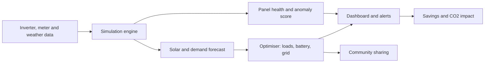

<div align="center">


<br>


**Predict solar output, schedule loads and batteries, and catch faulty panels, with software alone.**

[Live Demo](https://caffineblud.github.io/SolarSense/) · [Features](#features) · [Quick Start](#quick-start) · [How It Works](#how-it-works) · [Roadmap](#roadmap)


</div>

---

## Overview

Solar output rises and falls with weather and time of day. Sites with solar panels and a battery often waste surplus energy, buy expensive evening grid power, or lose output to dust and faults they never notice.

**SolarSense** is an AI-based energy manager for solar-plus-battery sites such as campuses, MSMEs, farms and villages. It works on the inverter and meter data a site already has, so no new hardware is needed.

This repository holds the **working prototype**: a single HTML file running on simulated data, built for the Smart India Hackathon 2026.

> [!NOTE]
> All numbers in the prototype come from a built-in simulation. It shows how the product behaves; it does not read real inverters yet.

---

## Status Board

| | |
|:--|:--|
| **Team** | The Digital Artisans (ID `140147`) |
| **Problem Statement** | `SIH26200` · Student Innovation, renewable / sustainable energy |
| **Category** | Software |
| **Technology Bucket** | AI/ML, Cloud Computing, Blockchain |
| **Prototype** | Single file, no build step, no backend |
| **Size** | about 31 KB |
| **Languages** | English and Hindi, switchable live |
| **Themes** | Light and dark, remembered between visits |

---

## Features

| Screen | What you can do |
|:--|:--|
| **Dashboard** | Watch a sun cross the sky as the clock moves. Live solar output, demand, battery %, grid draw, rupees saved and CO₂ avoided. Chart shows solar vs demand for the day. |
| **Forecast** | 48-hour solar forecast with a confidence band. Switch between Clear, Cloudy and Monsoon to see accuracy and uncertainty change. |
| **Optimiser** | Compare Usual vs Optimised schedules. Hour-by-hour strip shows when the site runs on solar, charges, discharges or uses the grid. Each load shows a plain-language reason. |
| **Panel Health** | 12 panels coloured by efficiency, anomaly score per panel, dust alerts, **Simulate dust** and **Mark as cleaned** buttons. |
| **Community** | Three neighbouring sites with live surplus or shortfall, and suggested peer-to-peer energy shares you can accept. |
| **Impact** | Monthly savings, solar used on site, CO₂ avoided, trees equivalent, and a 6-month savings chart. |

### Across the whole app

- **Run demo** replays a full 24-hour day in seconds.
- **Offline mode** switch shows the edge-mode banner: *Running on local edge mode, will sync when online*.
- **Hindi / English** toggle translates every label, reason and alert.
- **Touch or hover** any chart for exact values. Click the dashboard chart to move the clock.
- Mobile bottom tabs and a desktop sidebar, with keyboard focus styles.

---

## Prototype vs Planned Product

| Capability | Prototype (this repo) | Planned product |
|:--|:--:|:--:|
| Solar and demand forecast | Simulated curves | XGBoost, LSTM, pvlib model |
| Weather data | Clear / Cloudy / Monsoon presets | Open-Meteo, NASA POWER |
| Load and battery scheduling | Rule-based hourly plan | Cost and carbon optimiser |
| Panel fault detection | Efficiency threshold and anomaly score | Isolation Forest on inverter data |
| Explanations | Written reasons per load | SHAP-backed plain-language advice |
| Offline edge mode | UI banner | Local scheduling, later sync |
| Community sharing | Suggested transfers, accept button | Metered peer-to-peer sharing |
| Backend and storage | None | FastAPI, TimescaleDB, MQTT |
| Apps | One responsive web page | React dashboard and Flutter app |
| Security | n/a | MFA, encrypted storage, RBAC |

---

## Quick Start

No installation and no dependencies.

```bash
# 1. Clone
git clone https://github.com/caffineblud/SolarSense.git
cd SolarSense

# 2. Open directly
open index.html          # macOS
start index.html         # Windows
xdg-open index.html      # Linux

# 3. Or serve locally
python -m http.server 8000
# then visit http://localhost:8000
```

> [!TIP]
> Press **Run demo** first to watch a full day play out, then try the weather buttons on the Forecast tab.

---

## How It Works



### Simulation model

| Parameter | Value used in the prototype |
|:--|:--|
| Solar array | 12 panels, about 12 kW peak |
| Weather factor | Clear `1.0` · Cloudy `0.5` · Monsoon `0.25` |
| Forecast accuracy shown | 94% · 86% · 77% |
| Battery | 20 kWh, 3 kWh reserve kept |
| Grid price | ₹7/kWh, ₹9/kWh at evening peak (6 to 10 pm) |
| Grid carbon factor | 0.82 kg CO₂ per kWh |
| Peer-to-peer price | ₹5/kWh vs ₹8/kWh grid |
| Panel colour bands | green ≥ 93% · amber 85 to 92% · red < 85% |

### Shiftable loads

| Load | Power | Usual time | Optimised time |
|:--|:--:|:--:|:--:|
| Water pump | 2.2 kW | 06:00 to 08:00 | 11:00 to 13:00 |
| EV charger | 3.3 kW | 19:00 to 22:00 | 12:00 to 15:00 |
| Washing machine | 1.0 kW | 20:00 to 21:00 | 13:00 to 14:00 |
| AC pre-cooling | 1.8 kW | 18:00 to 20:00 | 15:00 to 17:00 |

### Hour-by-hour modes

| Mode | Meaning |
|:--|:--|
| Running on solar | Solar covers demand |
| Battery charging | Surplus solar fills the battery |
| Battery discharging | Battery covers demand, usually in the evening |
| Using grid | Solar and battery are not enough |

---

## Project Structure

```text
SolarSense/
├── index.html      # the whole prototype: markup, styles and script
├── README.md
├── assets/         # screenshots and demo gif (add your own)
└── docs/           # SIH presentation PDF and synopsis
```

---

## Tech Stack

| Layer | Prototype | Planned |
|:--|:--|:--|
| Frontend | HTML, CSS, vanilla JavaScript | React, Flutter |
| Charts | Hand-drawn inline SVG | Same approach, live data |
| Fonts | Outfit, Noto Sans Devanagari | Same |
| Backend | none | Python, FastAPI |
| Data | in-memory simulation | TimescaleDB, MQTT |
| AI / ML | rule-based simulation | XGBoost, LSTM, Isolation Forest, SHAP, pvlib |
| Deployment | GitHub Pages | Docker on cloud or edge |

---

## Roadmap

- [x] Six-screen interactive prototype
- [x] Hindi and English
- [x] Light and dark themes
- [x] Offline edge-mode banner
- [ ] Replace simulated curves with real weather data
- [ ] Train forecasting models on public solar datasets
- [ ] Read live data from inverters over MQTT or Modbus
- [ ] Real fault detection with Isolation Forest
- [ ] React dashboard and Flutter mobile app
- [ ] Pilot on a campus solar setup

---

## Version History

| Version | Stage | Notes |
|:--|:--|:--|
| `v0.1` | Concept | SIH idea presentation and portal submission |
| `v0.2` | First prototype | Dashboard, forecast, optimiser, panels, community, impact |
| `v1.0` | Current prototype | Hour-by-hour plan, dust simulation, accept-share flow, 6-month chart, day and night sun scene, light and dark themes, saved language |

---

## Team

<div align="center">

**The Digital Artisans** · Team ID `140147`

[](https://github.com/caffineblud)
[](https://linkedin.com/in/yashsingh200606)
[](https://leetcode.com/Yashsingh200606)

<br>


</div>

---

## Contributing

Ideas and fixes are welcome.

```bash
git checkout -b feature/your-idea
git commit -m "Add your idea"
git push origin feature/your-idea
```

Then open a pull request.

---

## License

Released under the [MIT License](LICENSE).

<div align="center">

**Built for Smart India Hackathon 2026**

*Less guessing, more sunlight used.*

</div>
